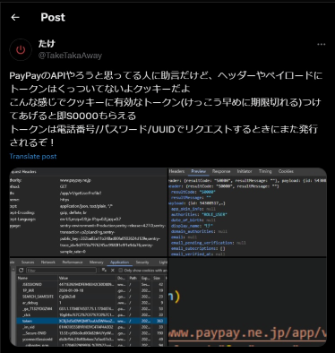

# PayPaython 
PythonからPayPay APIを操作するシンプルで使いやすいAPIラッパー   
### >> ```pip install paypaython``` <<
## [ ! ] PayPayからのレスポンス集 -> *[PayPayResponce.md](https://github.com/taka-4602/PayPaython/blob/main/PAYPAYRESPONCE.md)*
PayPay APIを使った時に返されるレスポンスをまとめたドキュメントです  
返ってきたレスポンスにどんな意味があるか知りたい場合、このドキュメントが役に立ちます  
もしドキュメントに載っていないレスポンス受け取った方、レスポンス.jsonを添付してtakaまで連絡くれると非常に助かります！！  
## 始める前に確認すること
### ログインを3回失敗するとアカウントが一時ロックされる
PayPayのサポートに連絡することで早く解除してもらえるみたいです (めんどくさいけど)
### セッションを作りすぎない
セッションを大量に作るとアカウント凍結の可能性があるみたいです (僕は未確認)
### 日本からしかアクセスできない
ふつうにブロックされます  
海外のバーチャルマシンとかを使う場合はプロキシを使いましょう
## すでにPayPayを操作できるDiscordのBotをデプロイしてます！
↓Bot招待リンク↓  
https://discord.com/api/oauth2/authorize?client_id=1189119988678803496&permissions=8&scope=bot
## 注意：PayPaython 1.x.x系と2.x.x系は別物です
APIラッパー側の機能を減らしてユーザー側の自由度を上げたものが2.x.x系です  
printも消してエラー判定のコードも消しています  
もし自由度よりもターミナルでちまちまやりたい方は1.x.x系をおすすめします  
- ```pip install paypaython==1.1.2```
## Let's Go!
- ```pip install requests``` (PayPayのAPIにリクエストするんだから必須)
- ```pip install paypaython``` (これ)

この2つをインストールしたらリポジトリにあるlets_go.pyからすぐに使い始めることができます！
### lets_go_2.x.x.py
```python
import PayPaython

#ログイン
paypay=PayPaython.PayPay(phone="08012345678",password="Test-1234")#ログイン済みclient_uuid="str"をセットするとOTPをパスできます #token="str"トークンをセットするとログインをパスします #proxy=dictでプロキシを設定できます
otp=input(f"SMSに届いた番号:{paypay.pre}-")
print(paypay.login(otp))#uuid確認用に["client_uuid"]にわざとuuidくっつけてます
#SMSの認証番号を再送
print(paypay.resend_otp(paypay.refid))#refidの使い道ができた
otp=input(f"SMSに届いた番号:{paypay.pre}-")#もっかい入力
print(paypay.login(otp))
#送金リンク確認
print(paypay.check_link("osuvUuLmQH8WA4kW"))#ぺいぺい送金リンクの https://pay.paypay.ne.jp/osuvUuLmQH8WA4kW <-ここね
#or
print(PayPaython.Pay2().check_link("osuvUuLmQH8WA4kW"))#ログインなしでcheck_linkを使えるPay2クラスです #これもproxy=dictでプロキシを設定できる
#送金リンク受け取り
print(paypay.receive("osuvUuLmQH8WA4kW"))#パスワードはpassword=str #事前にcheck_linkして返ってきたdictを引数infoに入れるとそのdictを使うようになります
#送金リンクを辞退
print(paypay.reject("osuvUuLmQH8WA4kW"))#これもinfoにdictつっこめる
#送金リンクを作成
print(paypay.create_link(kingaku=1,password="1111"))#パスワードはpassword=str
#残高確認
print(paypay.balance())
#ユーザー情報
print(paypay.user_info())
#ユーザーの表示情報
print(paypay.display_info())
#ユーザーの支払い方法
print(paypay.payment_method())
#取引履歴
print(paypay.history())
#指定したexternalidのユーザーに直接送金
print(paypay.send_money(kingaku=1,external_id="048f4fef00bdbad00"))#このidはてきとーです
#送金してもらうためのURLを作成する(PayPayアプリのQRコードとおなじ)
print(paypay.create_p2pcode())
#支払いのワンタイムコードを作成する
print(paypay.create_payment_otcfh())
```
いちおう#コメントで大まかな使い方は記載してます  
大まか...ですがほんとうにこれだけです、とってもシンプル  
send_moneyで使うexternal_idはuser_infoにくっついてきます
### すでにログイン済みのclient_uuid or トークンでログイン
```python
paypay=PayPaython.PayPay("08012345678","Test-1234")
```
上のログイン部分にはあとclient_uuidとトークンとプロキシを引数に使えます  
```python
paypay=PayPaython.PayPay(phone="08012345678",password="Test-1234",client_uuid="d2d786a9-6a9f-49e1-9139-ba2f5f7f9f1d",token="とてもながい==",proxy={"http":"http://example.com"})
```
###### 引数全体としてはこんなカンジ
ログイン済みのuuidを使うとSMSに届く認証番号を入力しなくてもログインできます！  
そんなのないよって方はとりあえず電話番号とパスワードだけでログインしてください、ログインに成功するとuuidが確認できます
### uuidの確認
1.x.x系はログイン成功時にターミナルに表示されます  
2.x.x系はloginの返り値の["client_uuid"]に僕がわざとつけてます  
実際のAPIから来た返り値にはついてないです！  
### アクセストークンについて
トークンを入力するとログインをスキップします  
ちなみに2時間ほどで失効します (たぶん)  
失効ならS0001かS9999が返ってきます (てきとーなものを入れるとサーバーエラーになる)  
失効したら再ログインしてトークンを再発行する必要があります  
~~トークンログインについては1回Twitterでぼそっとつぶやいたのでそれを参考にしといてください~~  
-> PayPaython2.2.0 / 1.1.1でトークンログイン機能がつきました  
#### [Twitter](https://twitter.com/TakeTakaAway/status/1744998645488070877)  
  
###### これだけ  
え、トークンがわからないって...？  
そんなあなたに
```python
print(paypay.token)
```
よくできてるでしょ
### もう少し知る
```paypay.pre```
- ワンタイムパスワードの接頭語  
  TA-4602の"TA"の部分
  
```paypay.uuuid```
- ふつうにuuid  
  ログインの返り値につけたものとおんなじ  
  他にも.phoneとか.passwordもあるけどこれはユーザー自身が入力してるので役目なし  
  ~~.refidとかもあるけどユーザー側は特に使わないので役目なし~~  
  -> v2.3.0で追加されたresend_otpの引数に使えるようになりました
  
```paypaython 0.5.x```  
- requestsがtls_clientに置き換わったもの  
  隠しオプション的な  

```PayPaython.Pay2```
- check_linkはログインしていなくても使えるので、ログインなしでcheck_linkだけ使えるPay2クラスです  
  ```PayPatrhon.Pay2().check_link("osuvUuLmQH8WA4kW")```  
  Pay2()には引数にプロキシをぶちこめます  
  ```Pay2(proxy=dict)```
## コンタクト
↓Discordサーバー↓  
https://discord.gg/X5SNVYtRPR  
↑にてPayPayで寄付してくれると超嬉しいです！！
#### 追記
どうやらAme-xさんによってJavaScript版がリリースされたようです  
https://github.com/EdamAme-x/paypay.x.js  
JavaScript勢はそっちを参考にするのもアリです
## このAPIラッパーをPayPay詐欺とかいうクソしょーもないことに使わないでください。
